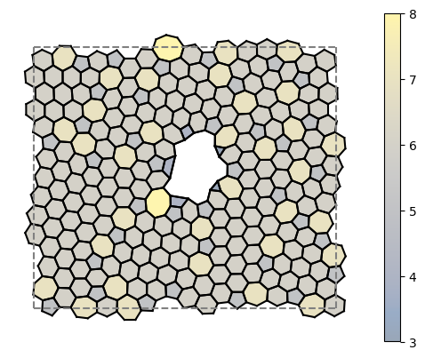

# LAMMPS Network Monte Carlo

This is a fork of the Wilson Group's [2D Network Monte Carlo](https://github.com/WilsonGroupOxford/Network-Monte-Carlo) repository that integrates [LAMMPS](https://github.com/lammps/lammps) to allow for faster energy evaluation.

## Input file

All the parameters are read by ignoring all characters after the first white space. The program has validation on the input data and will tell you if you've done something wrong. Fields marked with a '*' are not yet implemented

### I/O
`Output folder` The location to store output files, ie, the final network and prefix_all_stats.csv file.

`Output file prefix` The prefix for the file names in the out folder, eg 'test' would give 'test_A_crds.dat' etc.

`Input folder` The location to load an existing network from, only applicable if 'Create Network from Scratch' is enabled

`Input file prefix` The prefix for the file names in the input folder

`Create Network from Scratch?` *Dictates if the program loads from the input folder or generates a fresh network (case sensitive true/false)

### Network Properties
`Number of Rings` The number of rings to generate in the network if creating from scratch

`Min Ring Size` The minimum resulting ring size allowed when performing a bond switch

`Max Ring Size` The maximum resulting ring size allowed when performing a bond switch

`Enable Fixed Rings?` Whether or not the program loads __input_folder/fixed_rings.dat__ file. When chosing switch moves, any move that involves two nodes that are both a member of a fixed ring will be disallowed.

### Minimisation Procols
`Enable OpenMPI?` *Sets the program up to work on multiple threads

`Structure Type` Has to be one of the following: Graphene, Silicene, *TriangleRaft, *Bilayer or *BoronNitride

### Monte Carlo Process
`Random Seed` An integer > 0 that is used for the random number generator used for selecting bonds to switch and the metropolis condition

`Process for choosing bonds to switch` Has to be either 'Random' (no preference for any bonds) or 'Weighted' (Exponential decay away from the centre of the network)

`Weighted Decay` A float that dictates the rate of decay from the centre of the network if using the 'Weighted' bond selection process. Use a negative value to invert the preference for bonds near the edge.

### Monte Carlo Energy Search
`Start Temperature (10^x)` The log of the starting temperature for the annealing process (no units)

`End Temperature (10^x)` The log of the end temperature for the annealing process (no units)

`Temperature Increment (10^x)` The log of the temperature increment for the annealing process (no units)

`Thermalisation Temperature (10^x)` The log of the temperature for thermalisation (no units)

`Steps per Temperature` The number of steps per temperature increment during the anneaing process

`Thermalisation Steps` The number of steps for thermalisation

### Potential Model
`Maximum Bond Length` The maximum bond length allowed for the final state of nodes involved in a switch (Bohr Radii)

`Maximum Angle` The maximum angle allowed for the final state of nodes involved in a switch

### Analysis
`Analysis Write Interval` Dictates how often analysis is written to prefix_all_stats.csv in steps (small performance hit ~1.2x slower)

`Write a Movie File?` Tells LAMMPS to write a .mpg file of the simulation (huge performance hit takes ~15x slower)

## Method
The simulation is split into two parts, thermalisation and annealing. During thermalisation, the temperature is constant, and during the annealing process, the temperature decreases to the end temperature. The acceptance of a move is governed by 3 hurdles:

* The nodes involved in the move have no angles greater than the maximum angle size
* The nodes involved in the move have no bond lengths greater than the maximum bond length
* The energy of the final state is low enough such that it is accepted by the metropolis condition at the given temperature

The lower the temperature, the less likely the metropolis condition accepts the move.

## Further Reading

* [Installing Dependencies](docs/installing_dependencies.md)
* [Setting Up a Potential](docs/setting_up_a_potential.md)

## Credit

Credit must be given to [Oliver Whitaker](https://github.com/oliwhitg) for the concept of using LAMMPS and [David Ormrod Morley](https://github.com/dormrod) for the origial NetMC code.
