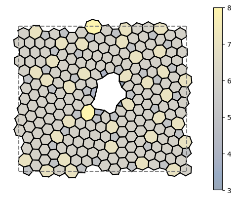

# Bond Switch Simulator

This is a fork of the Wilson Group's [2D Network Monte Carlo](https://github.com/WilsonGroupOxford/Network-Monte-Carlo) repository that integrates [LAMMPS](https://github.com/lammps/lammps) to allow for faster energy evaluation.

## Method
The simulation is split into two parts, thermalisation and annealing. During thermalisation, the temperature is constant, and during the annealing process, the temperature decreases to the end temperature. The acceptance of a move is governed by 3 hurdles:

* The nodes involved in the move have no angles greater than the maximum angle size
* The nodes involved in the move have no bond lengths greater than the maximum bond length
* The energy of the final state is low enough such that it is accepted by the metropolis condition at the given temperature

The probability of the metropolis condition accepting the move is governed by:
$$P(T) = min(1,  e^{-\Delta E/T})$$

The lower the temperature, the less likely the metropolis condition accepts the move, and if the energy change is < 0, the move is accepted immediately.

## Further Reading

* [Installing Dependencies](docs/installing_dependencies.md)
* [Building and Running](docs/building_and_running.md)
* [Setting Up The Input File](docs/setting_up_the_input_file.md)
* [Setting Up a Potential](docs/setting_up_a_potential.md)

## Credit

Credit must be given to [Oliver Whitaker](https://github.com/oliwhitg) for the concept of using LAMMPS and [David Ormrod Morley](https://github.com/dormrod) for the origial NetMC code.
